# mini_projects

# mini_projects

You will need the following python libraries 

Libraries, Version, How to Install using Anaconda
-------------------------------------------------------------------
	--------------------------------------------------------------------------------
	LIBRARY		|    VERSION	|  ANACONDA INSTALLATION 
	----------------|---------------|-----------------------------------------------
	Python 		|     3.8	|         	
	matplotlib 	|    3.5.1	|  conda install -c conda-forge matplotlib 	
	torch 		|    1.11.0	|  conda install -c pytorch pytorch 
	torchvision	|    0.12.0	|  conda install -c conda-forge torchvision
  	sklearn		|    1.0.2	|  conda install -c anaconda scikit-learn
	-------------------------------------------------------------------------------
  
 This github repository contains different files 
 ------------------------------------------------------------------
  	model.py	: 	The file has the model used for the training 
  	data_handler.py :    	This contains both the preprocessing of the data and the training loop 
  	prediction.py   :    	This contains the file for making the prediction after the training is complete 
  

Datasets - oxford-102-flowers-classification
------------------------------------------------------------------

1st function - color_map()
-----------------------------------------------------------------------------------------------------------------------------
	The color_map() fuctions show the range of the HSV colors. This map serves as a guide for
	further computer vision functions that has color in them. 
	Further images will be manipulated based on the color map
	The color_map() function accepts the path of an HSV color image. It then converts the BGR to BGR image and plots it. 
	
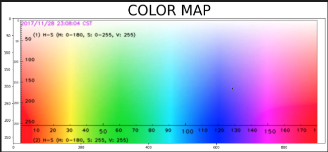

2nd function - color_spaces()
-----------------------------------------------------------------------------------------------------------------------------

     The next function similar to the color_map() is the color_spaces() function 
     The color_spaces() plot the various ranges of the HSV colors. It will also help to do color manipulations. 

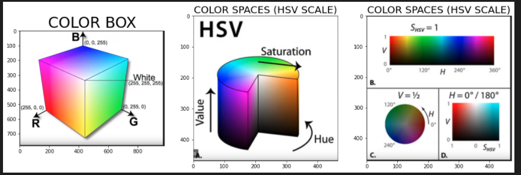

3rd function - bgr_rgb_gray()
-----------------------------------------------------------------------------------------------------------------------------
     The bgr_rgb_gray() function accepts the path of an image, which is normally in BGR format. 
     It then converts the BGR image to RGB and GRAY scaled images. The RGB image show the real representation of the 
     image before it was loaded. 
     The gray scaled image is useful for further analysis. This will be applied in the subsequent functions. 
     
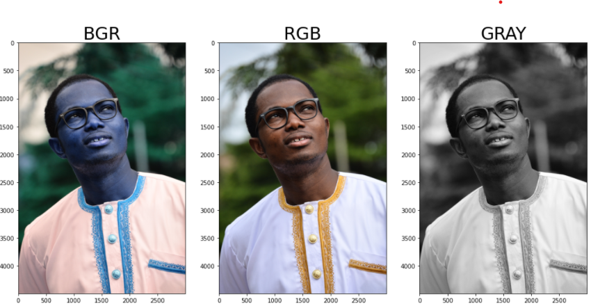

4th function -  annotation()
-----------------------------------------------------------------------------------------------------------------------------
     This functions accepts the path of an image an annotates few shapes and text on the image. 
     In the future, the function will be modified such that, the user can decide that shape and test to annotate on the 
     image  
     
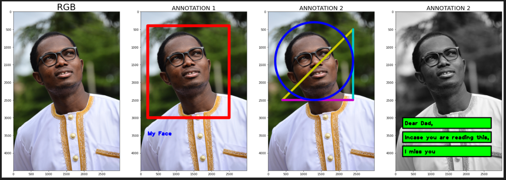

5th function - thresholding()
-----------------------------------------------------------------------------------------------------------------------------
     The thresholding() functions accepts the path of an image an converts it to different threshold formats. Depending on what 
     do, each threshold format can be very useful. 

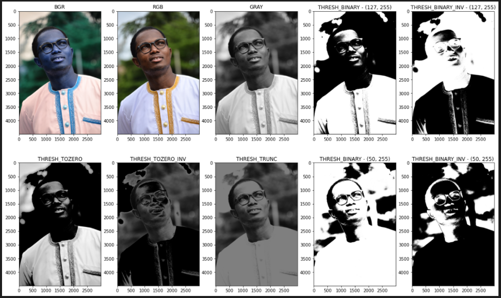

6th function - more_thresholding()
-----------------------------------------------------------------------------------------------------------------------------
     This is similar to the previous function

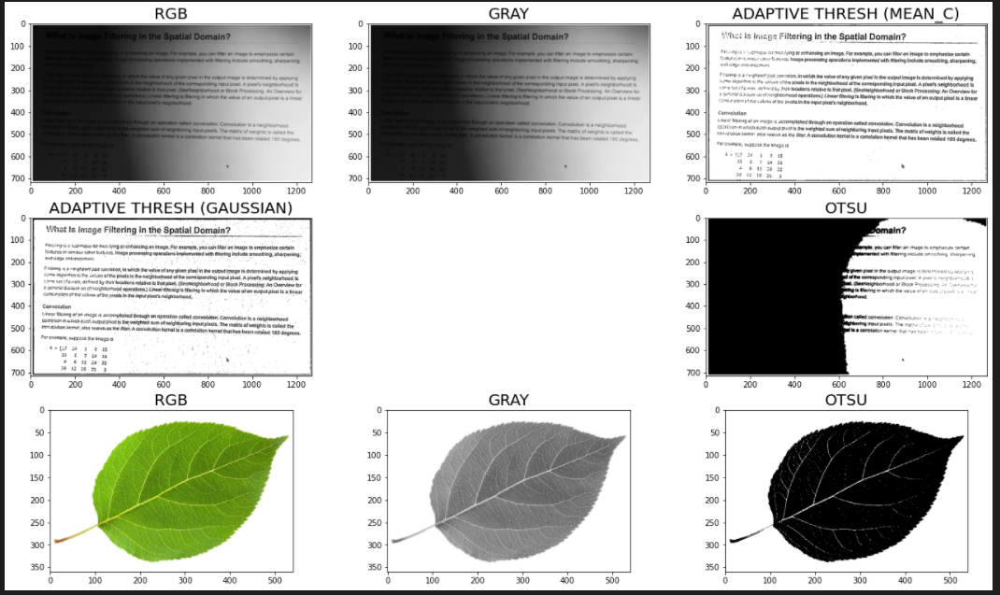

7th function - morphological_transformations()
-----------------------------------------------------------------------------------------------------------------------------
     This accepts the path of an image and transforms it to different morphological formats. The formats include 

          1. Dilation 
          2. Erosion 
          3. Opening 
          4. Closing 

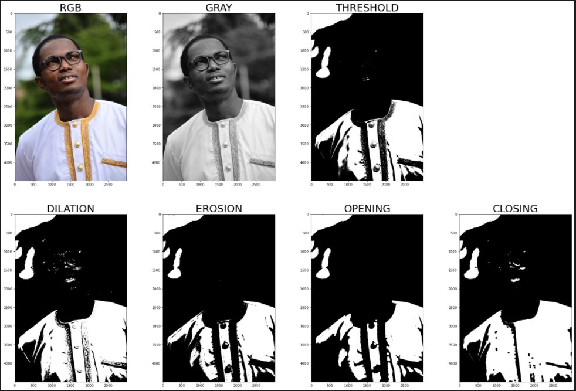

8th functions - filters_kernels()
-----------------------------------------------------------------------------------------------------------------------------
     This accepts the path of an image, and apply certains filters on it to transform the image into various blur images
     Some of the transformation process requires kenels. 
     
     The transform images include 
          1. Gray 
          2. Blur using defined kernels 
          3. Blur with the kernels 
          4. Gaussian blur 
          5. Median blur 
          6. Sharp blur 
          7. Edge image 
          8. Sobel (X)
          9. Canny images 
	  
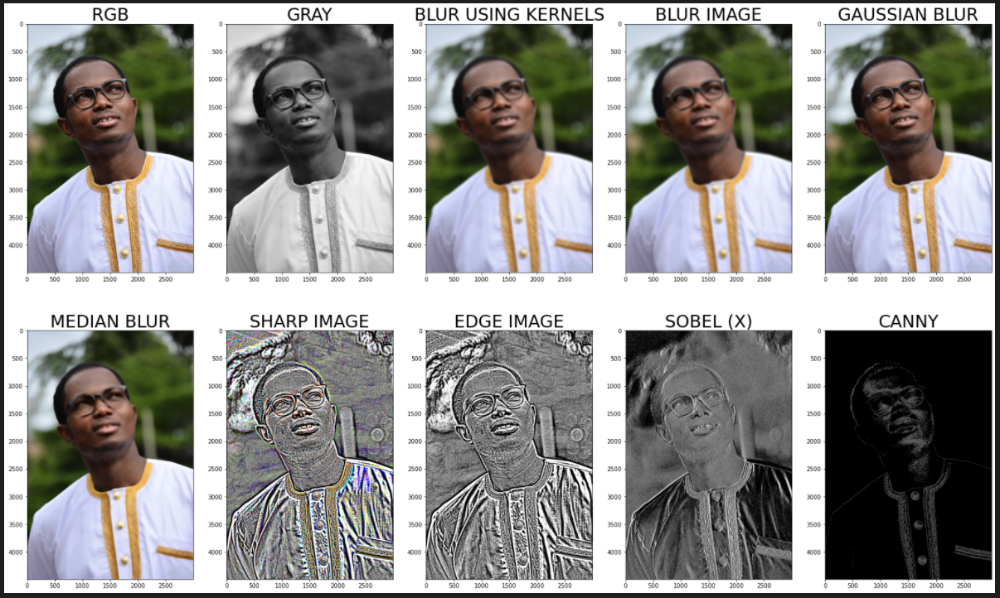

9th function - candy_ball()
-----------------------------------------------------------------------------------------------------------------------------
     The candy_ball function accepts an image path, and select specific colors of the image 

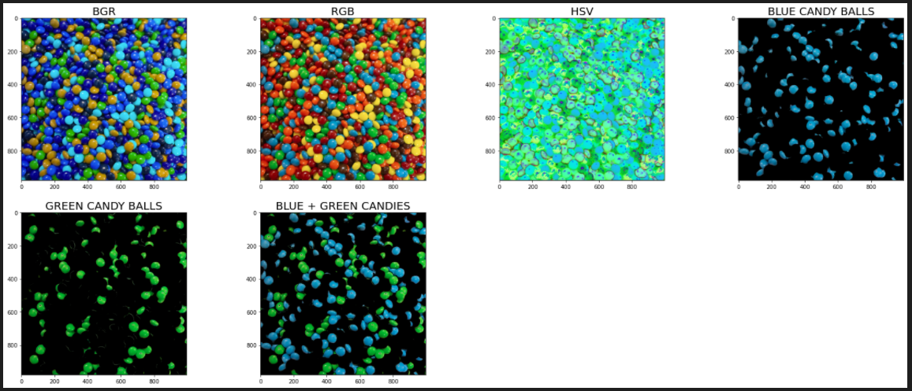

10th function - preprocess()
-----------------------------------------------------------------------------------------------------------------------------
     This function is useful for digit recognization. It accepts the path of an image contain a digit, then recognised the 
     digit and tries to apply a threshold to the images. 
     This makes the digit isolated and readable 
     
     
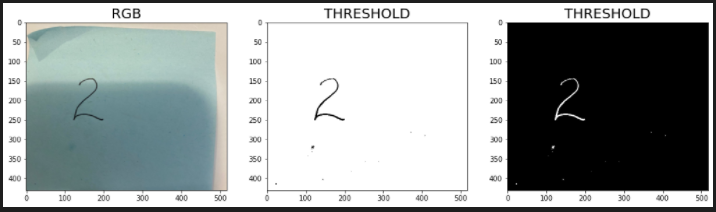

11th function - preprocess_plot_resize()
-----------------------------------------------------------------------------------------------------------------------------
     The preprocess_plot_resize() function is similar to the preprocess() function. In addition to isolating the digit in an image, 
     the preprocess_plot_resize() also crops the boundary around the digit which reduces the size of the overall image. 
     In deep learning, the size of the image plays significant role in the speed of the model 
     Lastly, this function also converts the cropped image to a rquired size to be used as an input for the deep learning algorithm. 

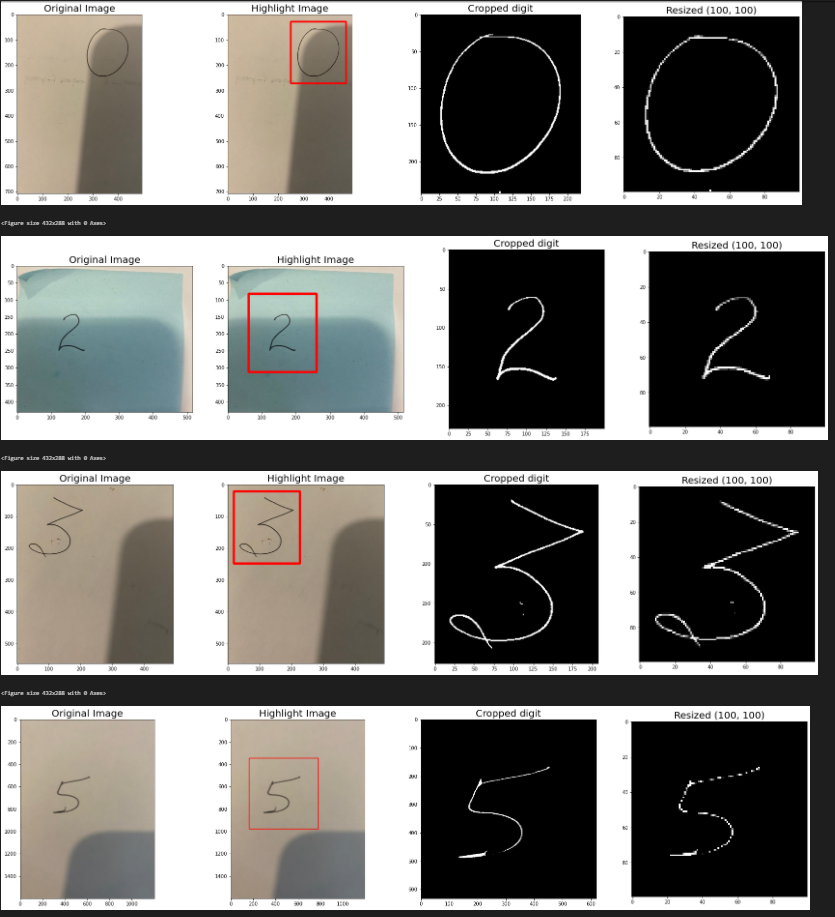

12th function - green_backgrounf()
-----------------------------------------------------------------------------------------------------------------------------
	This accepts an image and converts the backgroung to green 
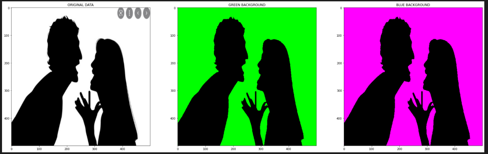

More functions will be added, and the current ones will be modified 
-----------------------------------------------------------------------------------------------------------------------------
	
